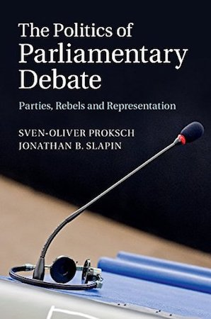
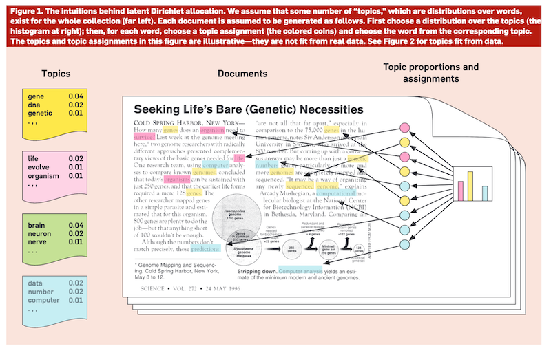

```{r start_time, eval = TRUE, echo = FALSE}
options(stringsAsFactors = FALSE)
knitr::opts_chunk$set(echo = FALSE, message = FALSE, warning = FALSE, cache = FALSE, eval = FALSE)
no_cores <- parallel::detectCores() - 1L
```


```{r, eval = TRUE, message = FALSE, echo = FALSE}
library(magrittr)
library(DiagrammeR)
library(polmineR)
library(DT)

# General-purpos packages
library(data.table)
library(parallel) # for detectCores()
library(devtools)

# Table layout
library(kableExtra)

# Packages for plotting
library(lattice)
library(ggplot2)
library(zoo)
library(xts)
library(RColorBrewer)

# Packages for corpus analysis and topic modelling
library(tm)
library(polmineR) # v0.8.0.9019 minimum
library(cwbtools) # use development version!
library(topicmodels)
library(topicanalysis) # use development version!
library(ldatuning)

# Data for ldatuning example
library(GermaParl)
```


```{r variables, eval = TRUE}
corpora <- c(
  btful = "BTFUL",
  ParisParl = "PARISPARL",
  TweedeTwee = "TWEEDEFUL",
  AustroParl = "AUSTROPARL"
)

id2corpus <- c(
  "BTFUL" = "GermaParl",
  "TWEEDEFUL" = "TweedeTwee",
  "PARISPARL" = "ParisParl",
  "AUSTROPARL" = "AustroParl"
)

parliaments <- c(
  "Nationalrat (Austria)" = "AUSTROPARL", 
  "Assemblée générale (France)" = "PARISPARL", 
  "Bundestag (Germany)" = "BTFUL", 
  "Tweede Kamer (Netherlands)" = "TWEEDEFUL"
)
```


## Sozialwissenschaftliche Korpusanalyse lehren

* Textdatenanalyse lehren - ein eigenes Feld:

  - **Methodologie:** Datenaufbereitung bis algorithmischer Datenanalyse
  - **Technologie:** Einführung in das Wissenschaftlichen Programmierens
  - **Substanz:** Kritische Datenkompetenz / critial data literacy


* Mit Vortrag und Diskussion verbundene Ziele:

  - Einblick in Erfahrungen aus Lehrkontext des PolMine-Projekts
  - Fokus auf interaktive Widgets im Lehrkontext
  - Erfahrungsaustausch - Diskussion mit Ihnen!
  - Identifikation von Potentialen für weitere Zusammenarbeit


## PolMine Project I {.smaller}

### Korpora

- **GermaParl**: Korpus der Debatten im Deutschen Bundestag 
- **UNGA** Verbatim Records of the United Nations General Assembly 
- **MigParl**: Debatten zu Migration und Integration in Landesparlamenten
- **MigPress**: Berichterstattung zu Migration und Integration in Süddeutscher Zeitung und Frankfurter Allgemeiner Zeitung (2000-2019)

*(Toolchain: **frapp**, **bignlp**, **biglda**, **trickypdf**)*

### Pakete für die Korpusanalyse

- **polmineR**: Verbs and nouns for corpus analysis 
- **RcppCWB**: R Wrapper for the C Code of the Corpus Workbench (using C++/Rcpp) 
- **cwbtools**: Tools to create and manage CWB indexed corpora 


## PolMine Project II {.smaller}

### Forschung 

- Projekt "Die populistische Herausforderung im Parlament" (DFG, 2019-2022)
- Projekt "Gesellschaftliche Konflikte und Dynamiken des Parteienwettbewerbs in der Migrations- und Integrationspolitik" (BMFSF, 2020-2023)
- Beteiligung an der Nationalen Forschungsdaten-Infrastruktur - KonsortSWD (DFG, 2020-2025)


### Open Educational Resources (OER)

- **UCSSR**: [Using Corpora in Social Science Research](https://polmine.github.io/UCSSR/#1)
- **Gadgets**: Online-widgets
- **YouTube**: Video-Tutorials zur Textdatenanalyse
- **learningR**: Interaktive Lernumgebung (proof of concept, lfd. Antrag auf Fellowship in der Lehre)


# Texttechnologie & critical data literacy

## XML als Datenformat für Textdaten {.smaller}

```{r, echo = FALSE, eval = TRUE}
xml_file <- "~/Lab/github/GermaParlTEI/16/BT_16_060.xml"
xml2::read_xml(x = xml_file) %>% as.character() %>% cat()
```


## UNGA Sample Document 2016 (A/71/PV.1)

<embed src="`r system.file(package = "trickypdf", "extdata", "pdf", "UN_GeneralAssembly_2016.pdf")`" width = "1000" height = "450"/>


## Datenaufbereitung: Stilisierter Workflow {.flexbox .vcenter}

```{r, echo = FALSE, eval = TRUE}
grViz("
digraph boxes_and_circles {

  graph [overlap = true, fontsize = 5, rankdir = LR, fixedsize = true]

  node [shape = circle, fillcolor = green, fontname = Helvetica, width = 1.5]
  'Data\nAcquisition'
  
  node [shape = circle, fillcolor = green, fontname = Helvetica]
  'Pre-Processing'

  node [shape = circle, fontname = Helvetica]
  XMLification

  node [shape = circle, fontname = Helvetica]
  'Natural\nLanguage\nProcessing'
  
  node [shape = circle, fontname = Helvetica]
  'Query\nEngine'

  'Data\nAcquisition' -> 'Pre-Processing'
  'Pre-Processing' -> XMLification
  XMLification -> 'Natural\nLanguage\nProcessing'
  'Natural\nLanguage\nProcessing' -> 'Query\nEngine'
  'Query\nEngine' -> 'Pre-Processing'
}
")
```

## Technologien bei der Datenaufbereitung

* OCR (Optical Character Recognition)
* reguläre Ausdrücke
* XML (eXtensible Markup Language) / TEI (Text Encoding Initiative)
* git (Versionierung von Code und Daten)
* Programmiersprachen:
  - Java (for Natural Language Processing)
  - Python (for anything, machine learning)
  - R (for data analysis and visualisation)


## Vier Parlamentskorpora

- Korpora für Arbeiten zu Migrationsdebatten im europäischen Parlamentarismus:
  - AustroParl (`r polmineR::size("AUSTROPARL")` tokens)
  - ParisParl (`r polmineR::size("PARISPARL")` tokens)
  - TweedeTweee (`r polmineR::size("TWEEDEFUL")` tokens)
  - GermaParl (`r polmineR::size("GERMAPARL")` tokens)

- cp. ParlSpeech dataset [@Rauh2017]
- Strukturelle und linguistische Annotation der Daten
- Indizierte Korpora verfügbar über Zenodo (Open Science Repository)


```{r size_speech_no_table, echo = FALSE, eval = TRUE}
speeches_sizes <- lapply(
  parliaments,
  function(corpus_id){
    message(corpus_id)
    size_file <- sprintf("~/Lab/github/ParlaCLARIN2020/Rmd/data/%s_speeches_sizes.csv", corpus_id)
    if (file.exists(size_file)){
      dt_min <- fread(size_file)
      dt_min[, "date" := as.Date(dt_min[["date"]])] 
    } else {
      dt <- corpus(corpus_id) %>% 
        as.speeches(s_attribute_name = "speaker", mc = FALSE) %>% 
        size()
      dt[, "date" := as.Date(gsub("^.*?(\\d+-\\d+-\\d+)_\\d+$", "\\1", dt[["name"]]))]
      dt_min <- dt[date >= as.Date("1999-10-01")][date < as.Date("2019-06-01")]
      fwrite(dt_min, file = size_file)
    }
    dt_min[, "corpus" := corpus_id]
    dt_min
  }
)

dt <- rbindlist(speeches_sizes)
dt[, "corpus_nice" := id2corpus[dt[["corpus"]]]]

```


## Korpusumfang pro Jahr (in Millionen Token) {.vcenter}

<div class = "centered">

```{r fig_1_corpus_size_per_year, echo = FALSE, eval = TRUE, fig.height = 4, fig.width = 10.5}
# trellis.strip.background <- trellis.par.get("strip.background")
# trellis.strip.background$col <- rep("#ededed", 7)
# trellis.par.set("strip.background", trellis.strip.background)
# 
# plot.polygon <- trellis.par.get("plot.polygon")
# plot.polygon$col <- "#d3d3d3"
# trellis.par.set("plot.polygon", plot.polygon)

corpus_size_by_year_list <- lapply(
  parliaments,
  function(corpus_id){
    dt_max <- size(corpus_id, s_attribute = "date")
    dt_max[, "date" := as.Date(dt_max[["date"]])]
    dt_min <- dt_max[date >= as.Date("1999-10-01")][date < as.Date("2019-06-01")]
    dt_min[, "year" := as.integer(format(dt_min[["date"]], "%Y"))]
    dt_min_aggr <- dt_min[,{list(size = sum(.SD[["size"]]))}, by = "year"]
    dt_min_aggr[,"corpus" := corpus_id]
})
corpus_size_by_year <- rbindlist(corpus_size_by_year_list)
corpus_size_by_year[, "corpus" := id2corpus[corpus_size_by_year[["corpus"]]]]
corpus_size_by_year[, "size" := corpus_size_by_year[["size"]] / 1000000]
corpus_size_by_year[, "year" := as.character(corpus_size_by_year[["year"]])]
# dt <- dcast(data = corpus_size_by_year, year ~ corpus, value.var = "size")

barchart(
  size ~ year | corpus,
  data = corpus_size_by_year,
  horizontal = FALSE,
  scales = list(x = list(rot = 90), cex = 0.75)
)
```

</div>

- Unterschiedlicher Gesamtumfang! Electoral Cycle!


## Reden als Analyseeinheit

<div class = "centered">

```{r fig_3_n_speeches_year, echo = FALSE, eval = TRUE, fig.width = 10.5, fig.height = 3}
dt[, "year" := format(dt[["date"]], "%Y")]
dt_min <- dt[size >= 100L]
dt_min_aggr <- dt_min[, {list(n_speeches = nrow(.SD))}, by = c("corpus", "year")]
dt_min_aggr[, "corpus" := id2corpus[dt_min_aggr[["corpus"]]] ]
setorder(dt_min_aggr, corpus, year)
barchart(
  n_speeches ~ year | corpus,
  data = dt_min_aggr,
  horizontal = FALSE,
  scales = list(x = list(rot = 90), cex = 0.75),
  ylab = "Total number of speeches",
  xlab = "Year"
)
```

</div>

- Was ist eine "Rede"? Zwischenrufe als Reden?!
- Operationale Definition: Reden als Äußerungen eines Redners, die nicht von mehr als 100 Worten anerer Redner unterbrochen werden. 


## Wie unterschiedlich Parlamente doch sind

<div class = "centered">

```{r fig_2_speech_length_histogram, echo = FALSE, eval = TRUE}
lattice::histogram(
  ~ size|corpus_nice,
  data = as.data.frame(dt), 
  breaks = seq(from = 0, to = 80000, by = 50),
  xlim = c(0L, 2000),
  scales = list(x = list(rot = 90), cex = 0.75),
  ylim = c(0,40),
  ylab = "Share of total number of speeches (percent)",
  xlab = "#tokens of speeches"
)
```

</div>


## Readings

<div style="float: left; width: 40%;">

</div>

<div style="float: right; width: 50%;">

</div>


# Interaktive Widgets in Flexdashboards


## Sentiment-Analyse mit SentiWS {.smaller}

```{r load_polmineR, eval = TRUE, message = FALSE}
library(polmineR)
use("GermaParl")
```

* Sentiment-Analyse: Wird XY im Diskurs positiv oder negativ bewertet?

* hier: diktionärsbasierte Sentiment-Analyse mit ["SentiWS"](http://wortschatz.uni-leipzig.de/de/download) (Leipziger Wortschatz-Projekts)

```{r get_senti_ws, eval = TRUE, message = FALSE}
gist_url <- "https://gist.githubusercontent.com/PolMine/70eeb095328070c18bd00ee087272adf/raw/c2eee2f48b11e6d893c19089b444f25b452d2adb/sentiws.R"
devtools::source_url(gist_url) # danach ist Funktion verfügbar
SentiWS <- get_sentiws()
```

```{r inspect_senti_ws, eval = TRUE, }
DT::datatable(SentiWS, options = list(pageLength = 8L, lengthChange = FALSE))
```


## Beispiel - Wortumfeldanalyse von "Islam" {.smaller}

```{r, show = FALSE, echo = FALSE, eval = TRUE}
options(polmineR.pagelength = 5)
```

Szenario: Wie haben Sich positive / negative Konnotationen von "Islam" im Zeitverlauf geändert?

```{r, eval = TRUE, message = FALSE, render = knit_print}
kwic(
  "GERMAPARL",
  query = "Islam",
  left = 10, right = 10,
  s_attributes = c("date", "speaker", "party")
)
```


## Sentiment-Scores im Zeitverlauf {.smaller}

* Anteil positiver / negativer Worte (entsprechend SentiWS) im Wortumfeld von "Islam" im Zeitverlauf

```{r, eval = TRUE, message = FALSE}
df <- context("GERMAPARL", query = "Islam", p_attribute = c("word", "pos"), left = 10, right = 10, verbose = FALSE) %>%
  partition_bundle(node = FALSE) %>%
  set_names(s_attributes(., s_attribute = "date")) %>%
  weigh(with = SentiWS) %>% summary()
df <- df[, c("name", "size", "positive_n", "negative_n")] 
df[["year"]] <- as.Date(df[["name"]]) %>% format("%Y-01-01")
df_year <- aggregate(df[,c("size", "positive_n", "negative_n")], list(df[["year"]]), sum)
colnames(df_year)[1] <- "year"

df_year$negative_share <- df_year$negative_n / df_year$size
df_year$positive_share <- df_year$positive_n / df_year$size

Z <- zoo(
  x = df_year[, c("positive_share", "negative_share")],
  order.by = as.Date(df_year[,"year"])
)
```


```{r, eval = TRUE, message = TRUE}
plot(
  Z, ylab = "polarity (+/-)", xlab = "year", main = "Word context of 'Islam': Share of positive/negative vocabulary",
  cex = 0.8, cex.main = 0.8
)
```


## Quanlifizierung / qualitative Evaluation {.smaller}

```{r, eval = TRUE, echo = FALSE, message = FALSE, render = polmineR::knit_print}
options("polmineR.pagelength" = 6L)
words_positive <- SentiWS[weight > 0][["word"]]
words_negative <- SentiWS[weight < 0][["word"]]

kwic("GERMAPARL", query = "Islam", positivelist = c(words_positive, words_negative), left = 10, right = 10) %>%
  highlight(lightgreen = words_positive, orange = words_negative) %>%
  tooltips(setNames(SentiWS[["word"]], SentiWS[["weight"]]))
```

# Interaktive Widgets | Tücken der diktionärsbasierten Sentiment-Analyse

## LDA Topic Modelling - die Intuition




## LDA Topic Model zum GermaParl-Korpus  {.smaller}

```{r, eval = TRUE, message = FALSE}
library(polmineR)
library("GermaParl")
library(topicmodels)

# GermaParl::germaparl_download_lda(k = 250L)
lda <- GermaParl::germaparl_load_lda(k = 250)
x <- terms(lda, 50)
```

```{r, echo = FALSE, eval = TRUE}
DT::datatable(x[,1:5])
```


## Flexdashboards für die Daten-Exploration

- Evaluation von Topic-Modellen durch verknüpfte interaktive Widgets in Flexdashboards [Link](https://polmine.github.io/gallery/topicmodel_flexdashboard.html)

- weitere Beispiele:
  - die Texte hinter Konkordanz-Analysen [Link](https://polmine.github.io/gallery/cooccurrences_dashboard.html)
  - die Konkordanzen hinter Kookkurrenz-Berechnungen [Link](https://polmine.github.io/gallery/cooccurrences_dashboard.html)
  - die Daten hinter Kookkurrenz-Graphen [Link](https://ablaette.github.io/sshoc_webinar_slides/gallery/unga_gradget.html)


# Nächste Schritte

## Perspektiven und Diskussion {.smaller}

- Als Aspekte einer *critical data literacy* hier diskutiert:
  - technologische Kenntnisse (wie Daten aufbereitet werden)
  - methodologische Kenntnisse (wie Daten sachgerecht ausgewertet werden)
  - substantielles Wissen (Kenntnis der Kontexte der Datenproduktion)

- Einbettung didaktischer Intuitionen in Lehr- und Lernforschung

- Konzeptionelles Wissen und Best Practices zur Nutzung interaktiver Materialien
  - in inverted classroom-Settings
  - in digitalen Lernsituationen

- Weiterentwicklung interaktiver Tools (widgets etc) und Tutorials zur tatsächlichen Nutzung (in Foliensätzen + x)

- Interaktive Tutorien (mit learnR) als nächster Schritt


## Literatur {.smaller}
